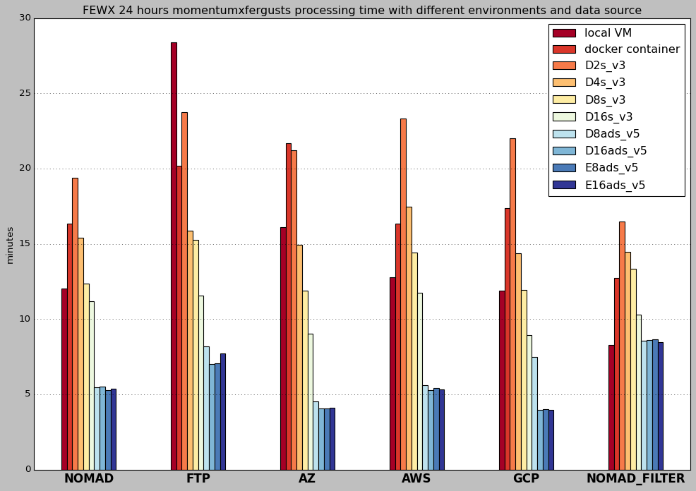

# Azure Virtual Machine Processing Optimization

## Overview
Pulling and processing the GFS (Global Forecast System) data from the NOMAD and FTP server locally is too slow. This project aims to test and benchmark the results using the Azure Virtual Machines paradigm to improve efficiency.

## Approach
1. Rewrite and optimize the scripts in a more pythonic way [see here](./GFS_processing_scripts/)
2. Use `Terraform` to deploy Azure virtual machines:
    - [See Here](/Terraform/README.md) for terraform commands instructions
    - We use [this script](./Terraform/vmss_config.sh) to configure the environment in virtual machine scale sets to be able to process the files.
3. [See here](/VScode_config.md) for instructions to connect to the virtual machine in the VS code. 
4. Test the speed in each environments and document the results.
5. [See here](./AZ_CLI_FOR_VM.md) for instructions to programmatically start and stop(deallocate) the VM. 

[This file](/vm_specs.md) documents the virtual machine's specs in detail, including type of processor, number of CPU, RAMs, and storage. 

See [this file](/Dockerfile) for docker container configuration.

## Result:

### 1. Speed wise: 
Generating 24 `momentumxfergusts` grib files with parameters [date: 20241009, cycle: 6, forcast hour: 1-24]:

|Environment \ Data Source (minutes)|Local VM|Docker Container|Azure VM [D2s_v3]|Azure VM [D4s_v3]|Azure VM [D8s_v3]|Azure VM [D16s_v3]|Azure VM [D8ads_v5]|Azure VM [D16ads_v5]|Azure VM [E8ads_v5]|Azure VM [E16ads_v5]|
|---|:---:|:---:|:---:|:---:|:---:|:---:|:---:|:---:|:---:|:---:|
|**NOMAD**|12.036|16.350|19.400|15.395|12.376|11.178|5.465|5.516|5.298|5.386
|**FTP**|28.400|20.200|23.750|15.892|15.242|11.571|8.200|7.001|7.054|7.724|
|**AZURE**|16.114|21.700|21.200|14.931|11.904|9.033|4.515|4.067|4.075|4.095|
|**AWS**|12.787|16.350|23.300|17.453|14.428|11.740|5.592|5.286|5.411|5.322|
|**GCP**|11.884|17.360|22.000|14.379|11.916|8.945|7.471|3.957|4.014|3.942|
|**NOMAD_FILTER**|8.266|12.750|16.500|14.451|13.317|10.294|8.559|8.603|8.640|8.476|

 

 

### 2. Cost wise:

|Azure VM [D2s_v3]|Azure VM [D4s_v3]|Azure VM [D8s_v3]|Azure VM [D16s_v3]|Azure VM [D8ads_v5]|Azure VM [D16ads_v5]|Azure VM [E8ads_v5]|Azure VM [E16ads_v5]|
|:---:|:---:|:---:|:---:|:---:|:---:|:---:|:---:|
|$0.0960/hour|$0.1920/hour|$0.3840/hour|$0.7680/hour|$0.4120/hour|$0.8240/hour|$0.5240/hour|$1.0480/hour

Note: You will only get charged when the virtual machine is running. The rate shown here is only for **Usage Rate**.

Take Azure VM [D16ads_v5] for example, the total cost to process 24 `momentumxfergusts` grib files would only be: 0.824/60*4.067 = 0.056 dollars, which is less than **6 cents**.

---

### 3. Visualization demonstration:

- momentumxfergusts

    

- rolling24hwindow

    

### 4. Graphical User Interface:

