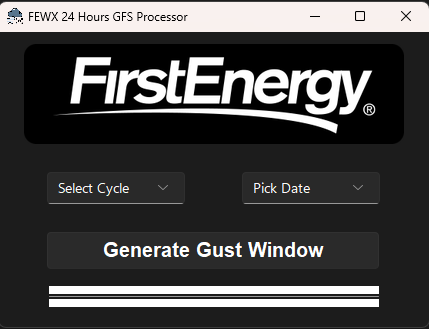

# Graphical User Interface

## Overview
This GUI is designed to improve and simplify 24 hours GFS gust processing. By selecting a cycle, picking a date, and clicking the button "Generate Gust Window", the backend will process and generate both the gust instant and gust window grib files to the external Azure Storage Container. After the process is finished, both the Virtual Machine Scale Sets and the Virtual Machine "jumpbox" will automatically stop (deallocated) to save money.  

## Demonstration
<div align=center>

</div>

## Note
- This GUI is developed using the python library `tkinter`.
    - Install the following packages before running the script:
        ```
        pip install tkcalendar sv_ttk azure-storage-blob
        ```
- In [gui_interface.py](./gui_interface.py), change the `SSH_KEY_PATH` value to where the ssh key path is on your local computer. This script is used to generate the GUI.

- In [azure_storage_info.json](../fewx-htf/fewxops/software/azure_storage_info.json), change the `azure_storage_connection_string` and `container_name` value to your settings. 

- [write_parameters.py](./write_parameters.py) is used to update parameters `date` and `cycle` stored in the Azure Storage Container.