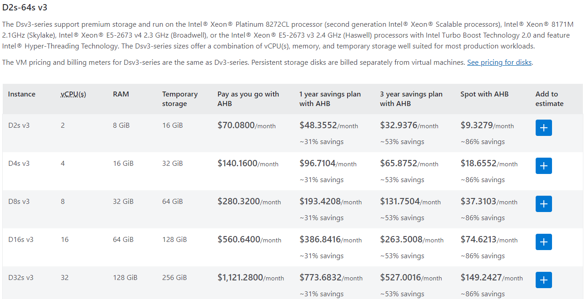
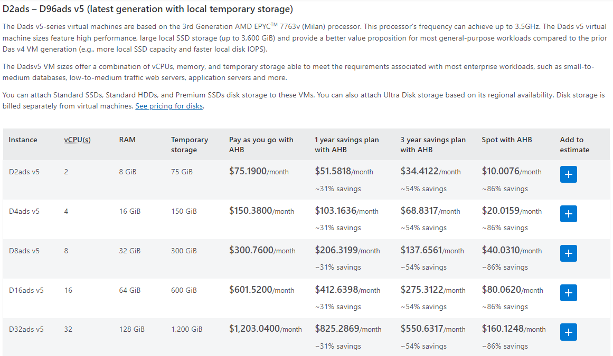
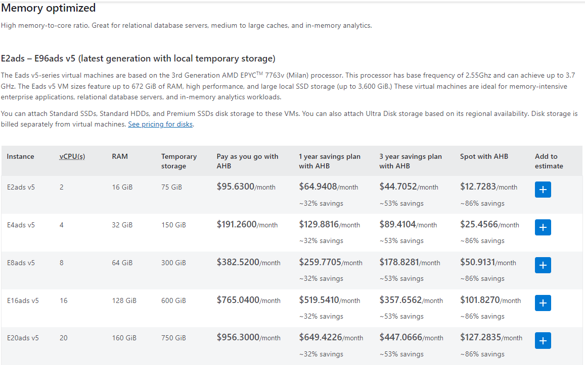

## 1. Local VM 
This VM has the following characteristics:

- 16 GB of memory
- 8 processing cores
- The storage is M.2-based SSD
- RHEL 8.10
- Linux 4.18.0-553.16.1.el8_10.x86_64 x86_64

The VM is hosted by Oracle VirtualBox 7.0.20

The host machine is:
- AMD Ryzen 9 5900X 12-Core Processor @ 3.70 GHz
- 64 GB RAM
- Windows 11 Pro

## 2. Docker Container
This container has the following characteristics:

- 8 GB of memory
- 16 processing cores
- RHEL 8.10

The host machine is:
- 12th Gen Intel(R) Core(TM) i7-1270P   2.20 GHz
- 16 GB RAM
- Windows 11 Pro

## 3. Azure VM

Reference Source : https://azure.microsoft.com/en-us/pricing/details/virtual-machines/red-hat/#pricing

### Dsv3 series - Intel, small local storage, common usage

### Dadsv5 series - AMD, large local storage

### Eadsv5 series - AMD, large local storage, memony optimized

